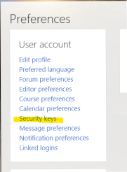
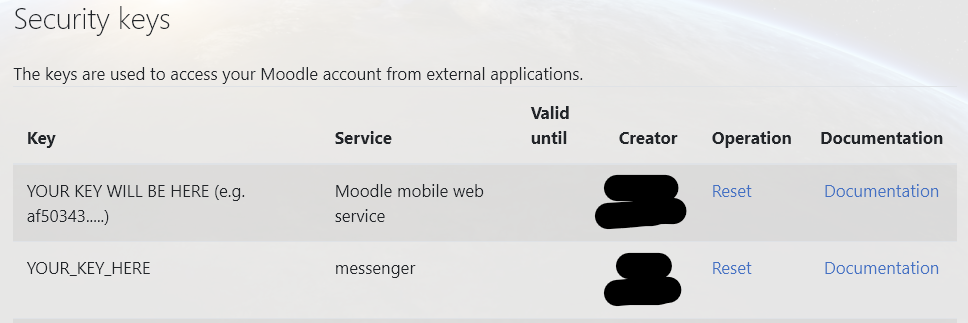

# Awesome School Stats :sunglasses: (`school-stats-powerbi`)

Contents

## Contents

- [Awesome School Stats :sunglasses: (`school-stats-powerbi`)](#awesome-school-stats-sunglasses-school-stats-powerbi)
  - [Contents](#contents)
  - [Intro](#intro)
  - [HOWTO Obtain Security Key for Moodle](#howto-obtain-security-key-for-moodle)
  - [History](#history)
    - [TL;DR (somewhat)](#tldr-somewhat)
  - [More History](#more-history)

----
## Intro

Using the Moodle web service, this package extracts Course and Grade info to feed into Power BI for pretty reports and AI insights!

Hope it helps someone. If not, I at least have a copy of the repo for my own purposes. 
Since my son's education is the most important thing, after managing Type-1 Diabetes, is school.
It is learning how to learn, develop ing productive habits, and handling feedback.
It determines the future.

> "Knowledge is power"
> --- *Sir Francis Bacon (or Thomas Jefferson, apparently there's flame wars)*

---

## HOWTO Obtain Security Key for Moodle

1. Login to `Moodle` as the Student.
2. Click the name/avatar at the top right.
3. Click `Preferences`.
4. Click `Security keys`.
5. Should end up on a URL ending 
   with something like 
   `/user/managetoken.php?sesskey=YOUR_SESSION_ID_THAT_DOES_NOT_MATTER`.

---

## History

### TL;DR (somewhat)

This started as a summary but turned into the full description. Hope it's useful.

My 13 year old son ("Bob") switched to online school to finish Grade 6 in 2020. We
decided to stay in online school for Grade 7. Tried using Notion and other
management techniques to track assignments. Process was tedious and manual.
Wound up in a two week sprint of getting things together during Jan/Feb 2021.

During this, as a parent, I wanted to see what assignments had not been handed
in, and what subjects my son was doing the best/worst in.

I just started using `Cypress` for automated browser testing and saw a chance to play with it,
push it outside the usual testing use case and turn it into a web scraper.

I had access to the "My Mentees" grade report through the school's 
online learning management system (LMS), which for Grade 6 was Google Classroom,
and for Grade 7 (Bob's current grade) the school used Moodle.

Moodle feels older, more limited, than Google Classroom.
I never got as deep into stats, analytics, devops, etc.. when he was using Google Classroom.

So I wrote some Cypress tests that would:

1. Login to Moodle
2. Visit the `My Mentee Grades Report`
3. Scrape the assignment feedback from the report.

The problems I found were:

1. Only some assignments were listed
   1. Teachers can hide assignments.
   2. I think that some assignments are auto-hidden after a certain time.
   3. I believe from past conversations that teachers like to keep the report page clean, for both the `Student` and the `Mentor (Parent)`.
   4. Different subjects have different report pages.
      1. Later found out that is because Moodle has a "`Grading Book`" which seems to be configured per `Course` *(subject)* 
         1. Is "subject" a local term? I'm from Calgary, Alberta, Canada 🍁.
   5. Final nail in the coffin was that I couldn't extract any date for assignments. 
      1. No idea what was sold and new.

## More History

As a parent of an Online Grade 7 Jr. High Student in Canada, I am helping my
son daily, hourly, and sometimes every 10 minutes-ish, to help him:

- Decide what to focus on, well learning how to manage himself
- Review school assignments
- Learn the subject matter in detail
- Study for quizes
- Manage Assignments
- Using a Kanban Board in [Notion](//notion.so)
- Follow-up on submitted assignments
  - Check for Feedback (grade and comments)
  - Reply to any actionable feedback
    - Common feedback at the beginning of the year was that a file would not
      be attached properly (sometimes due to confusing language on the
      submission page), or a few questions would be overlooked that needed
      responses added.
- Reflect on Feedback
  - What was awesome?
  - What can be done better?
  - How difficult was it?
  - Is the grade going to achieve goals for the Reporting Period, week, month,
    etc.

After close to six months online finishing Grade 6,(Feb-July 2020), when
COVID-19 became a global pandemic, me, my son, and his mom, decided to enroll
in online school for Grade 7 (Sep-July 2020/2021). 

There were numerous benefis to online scool, including:

1. FAR less sick days.
   - By far the number one benefit to us is that as a child with Type-1
     Diabetes, a common cold easily becomes a major infection, knocking him
     out for a few days, or a week at a time. 
   - There were over 20 sick days in Grade 6, and countless days not feeling
     well but still attending.
   - 

TODO: Finish

---

*Made with :heart: by [sqrl (Dad)](https://twitter.com/gregdevelops) and [Bobthebe3t (Child/Student)](http://www.bobisagamer.com/)*.

---
